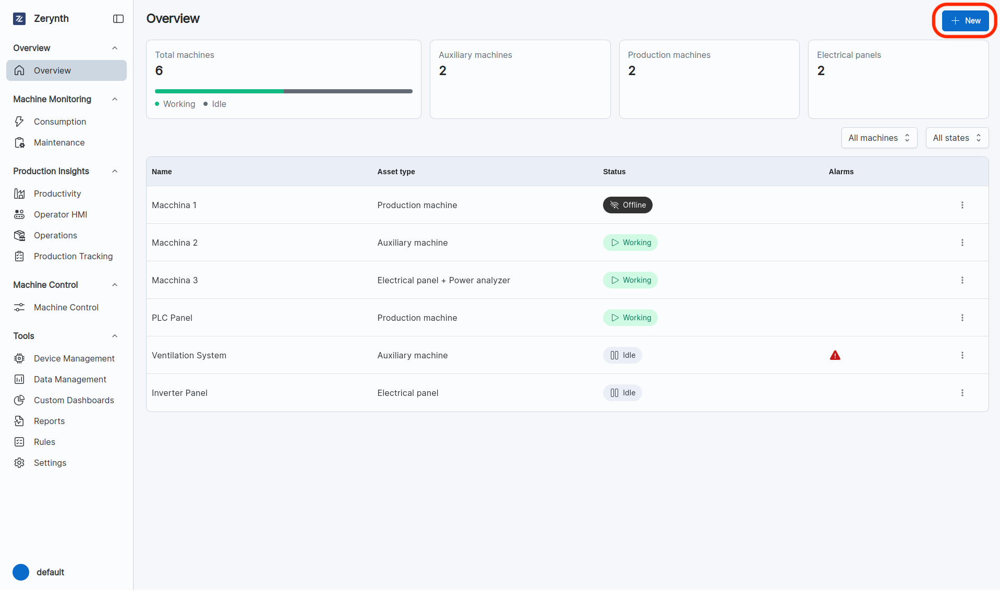
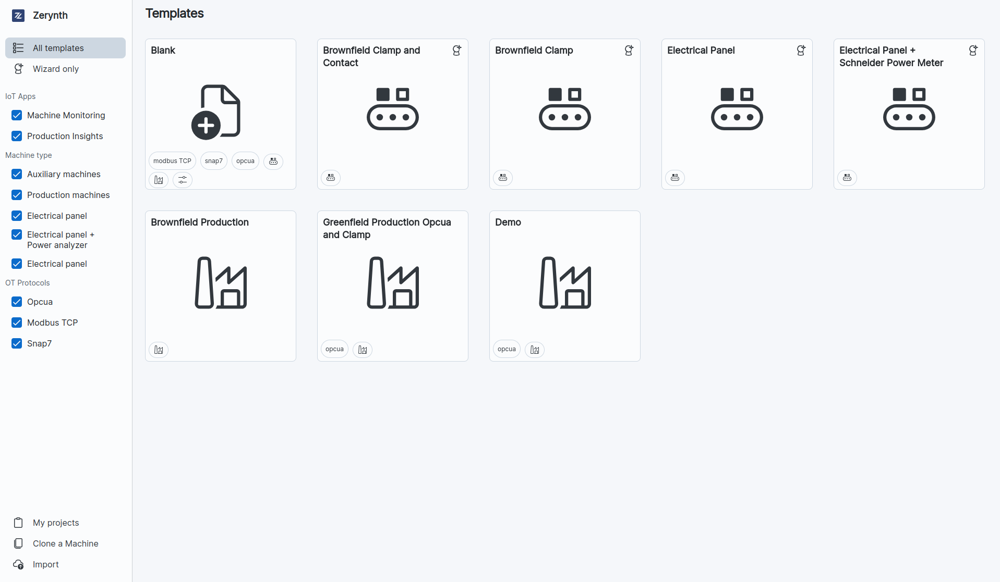
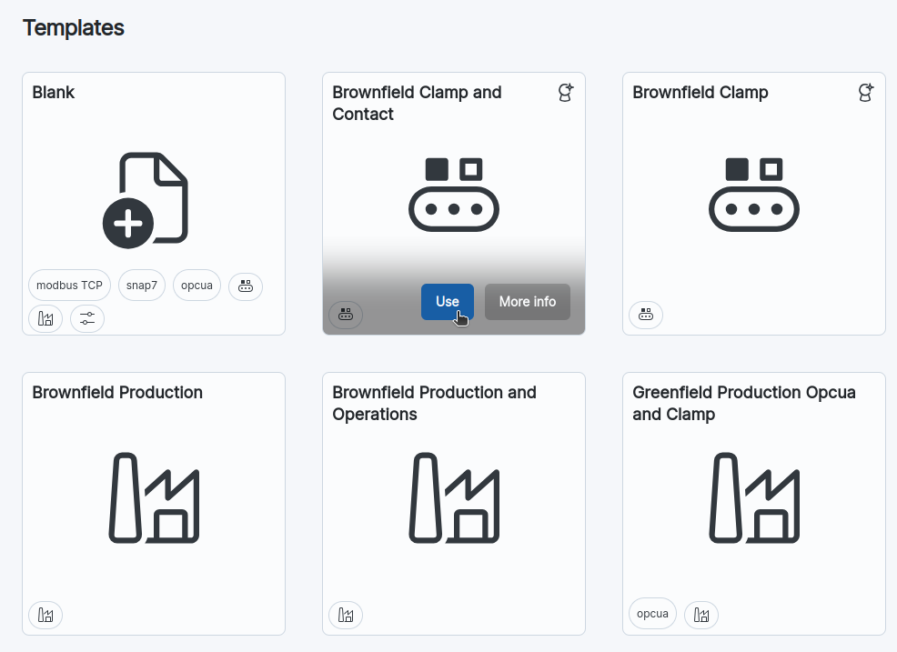
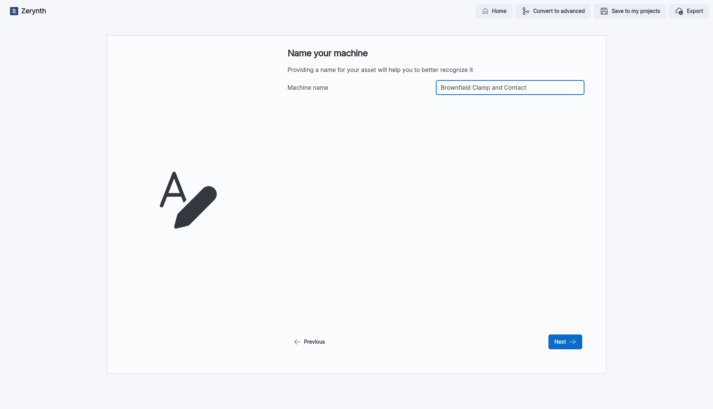
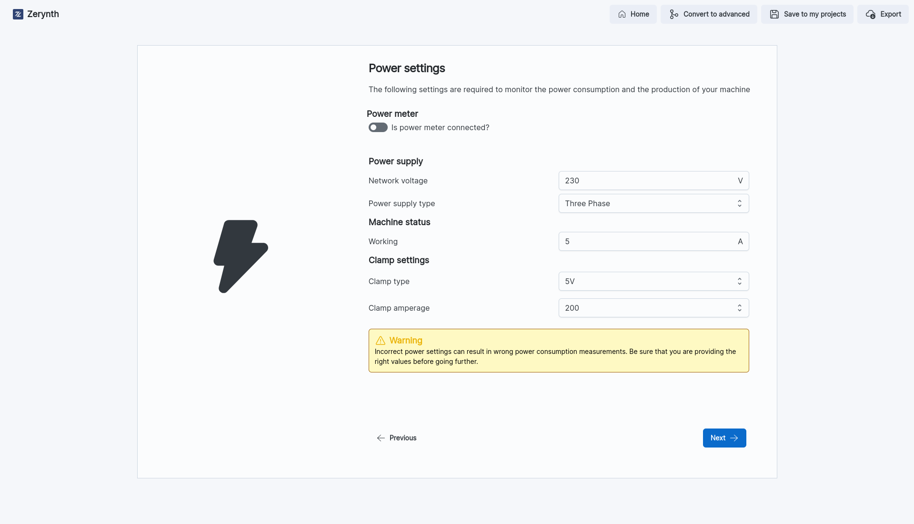
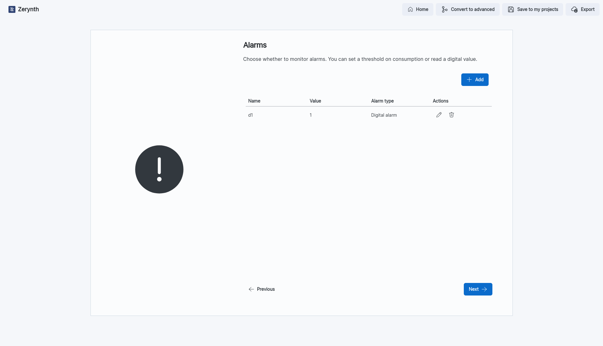
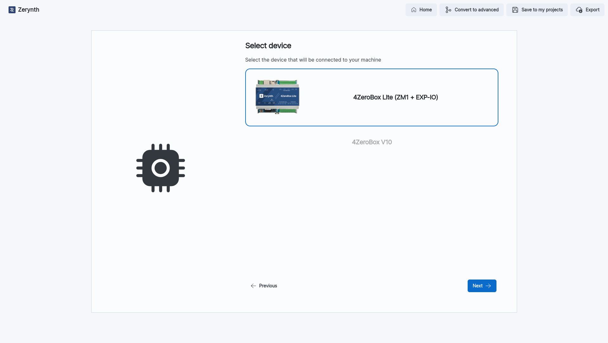
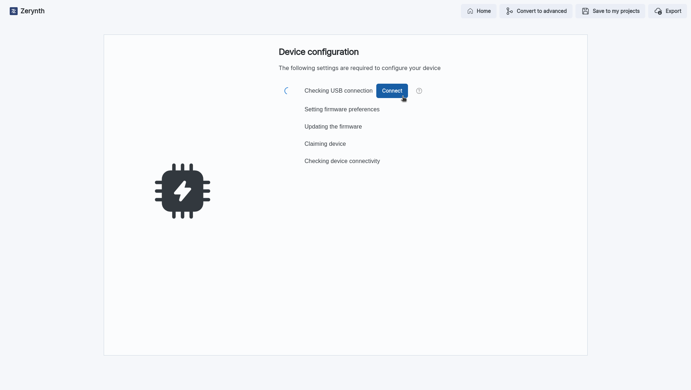
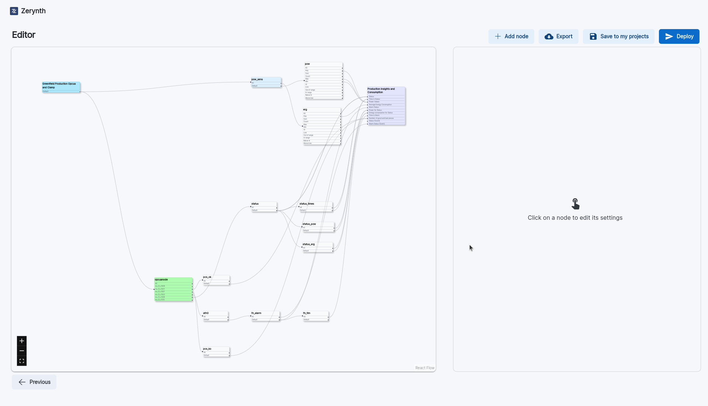
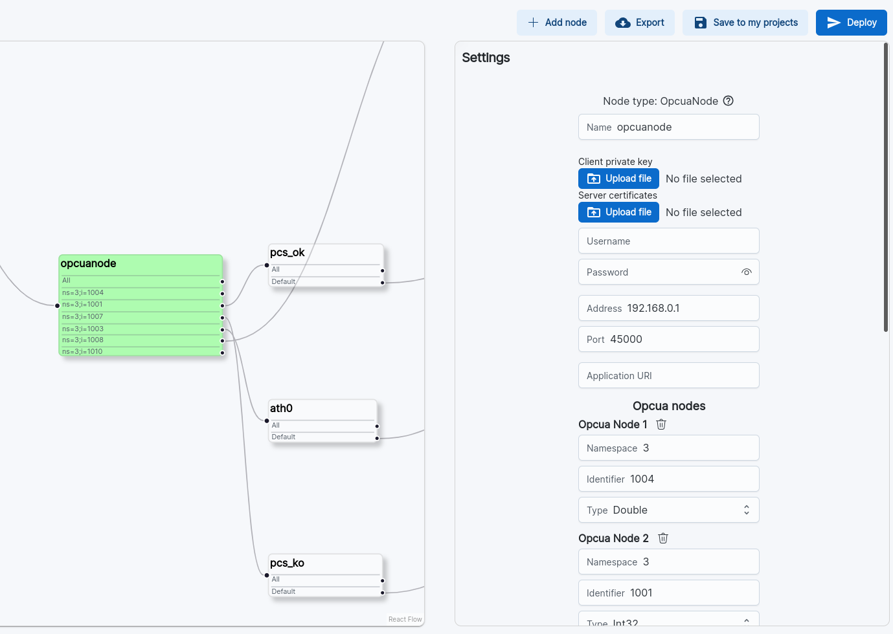

# Getting Started

The Configurator Tool allows you to create and add new devices to your account, and to configure them to analyse only the data that is relevant to you.

The configurator is accessible by clicking the `+ New` button located at the top right corner of the "Overview" Page. It offers a variety of templates that you can utilize to effortlessly create your customized device through a swift and user-friendly configuration process.

Some templates support the Wizard Mode, which allows you to configure your device in a few simple steps. The Wizard Mode consists of a series of steps that guide you through the configuration process.
You can decide to switch to the Advanced Mode at any time, which allows you to configure your device in a more detailed way, by using the Graph Editor.

!!! warning
    If you convert a configuration from Wizard Mode to Editor Mode you will not able to switch back to Wizard Mode.

Once you have opened the Configurator Tool, you can choose the template that best suits your needs. In the left side you can use Filters to find the template you are looking for.

You can filter by:

- *Supported Iot App*: the Iot App that you want to connect with your device to.
- *Machine Type*: the type of machine you want to connect to.
- *OT Protocol*: the protocol used by your machine.

## Templates

- **Blank**: The blank template allows you to create a new configuration from scratch, you can choose if create the configuration using the Wizard Mode or the Graph Editor.
- **Brownfield Clamp and Contact**
- **Brownfield Clamp**
- **Electrical Panel**
- **Electrical Panel with Schneider Power Meter**
- **Brownfield Production**
- **Brownfield Production Opcua and Clamp**

You can also access to *My Project* page by clicking on the button on the bottom left corner of the page, here you can find all of your custom templates that you have created. You can use them to create new configurations.

The **Clone a Machine** page allows you to create a new configuration starting from an existing one.

For using a template, you have to click on the **Use** button, that appear when you hover the mouse on the template.

## Connection of Brownfield Machines

Let's explore the process of connecting a Brownfield Machine to the platform using an example.

### Example: Configuring a brownfield machine

- *Select the Template*: We select the template that we wold like to use, in this case we select the template **Brownfield Clamp and Contact** that support the IoT app **Machine Monitoring**.

This template support the wizard mode, so we can configure our device in a few simple steps.

- *Name*: The first step is to choose the name that we want to assign to our device.

- *Power Settings*: In this case we have to choose the power settings of our device. We can choose if our device is connected to a Power Meter or not. Those settings are used to calculate the energy consumption of the machine.

- *Alarm Settings*: In this step we can choose the alarm settings of our device. We can add an alarm to the configuration by clicking on the **New** button on the top right corner, and then we can choose the type of alarm that we want to add, choosing between a *digital alarm* or a *Threshold* type alarm.

- *Select Device*: Here we can choose wich device we want to configure, and connect to the machine. In this case the only available option is the **4ZeroBox Lite (ZM1 + EXP-IO)**

- *Network Configuration*: Here you can configure which network you want to use to connect your device to the platform. In this case we choose the **Wi-fi** option. Then we have to set the Wi-fi settings of our device. Is it also possible to add one or more backup networks, in case the main network is not available.
- *Configure your Device*: Finally we can configure our device. By clicking the Connect Button it will appear a pop-up that allow us to select the serial port of our device. Then the configuration process will start and automatically configure the device. Once the configuration is completed, we can just going back to the overview page where we can see our device connected.

## Connection of Greenfield Machines

Let's explore the process of connecting a Greenfield Machine to the platform using an example.

### Example: Configuring a greenfield machine

- *Select Template*: For the configuration of a GreenField machine we can select the template **Greenfield Production Opcua and Clamp**
- *Name*: as in the previous example, we have to choose the name that we want to assign to our device.
- *Graph Editor*: this Template does not support the Wizard Mode, so we have to configure our device using the Graph Editor. The Graph Editor is a tool that allows you to configure your device in a more detailed way. It is composed by a series of nodes that you can connect to each other to create your configuration. Each node has a specific function, and you can configure it by clicking on it. You can also add new nodes by clicking on the **+ Add Node** button on the top right corner of the page.
  

- *Edit Settings*: Now we can edit the settings of our device by clicking the node we wold like to edit.

!!! Note
    We strongly recommand you to only edit the settings of the Green nodes, and not the other nodes.

In this case we can edit the opcua node settings, by clicking on it, and then edit the address field and the port field. After that we can click on the **Save** button on the bottom of the settings section.

- *Select Device*: As in the previous example we can select the device that we want to configure, and we select the **4ZeroBox Lite (ZM1 + EXP-IO)**
- *Configure Device Network*: As in the previous example we can configure the network of our device, and the backup networks.
- *Configure your Device*: Finally we can configure our device, by selecting the serial port from the pop-up that appear when we click the Connect button.
