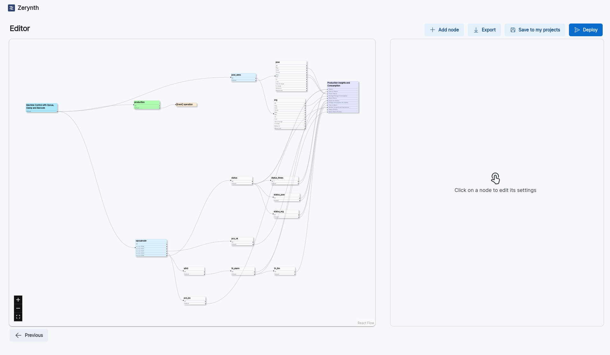

# Zerynth Advanced Configurator

## Graph Editor

The Graph Editor allows you to configure your device in a more detailed way, by using a graph that represents the configuration of your device.

The Graph that you create represents the flow of data from the device to the cloud, to the left of the graph you can find the root of the graph, that represents the machine, and continuing to the right you can find a first layer of nodes that represents the sensor connected to the device, after that you can find one or more layers of nodes that takes in input some data, compute new information and send it in output to the next layer of nodes.
In the last layer of nodes you can find the nodes that describe wich type of payload the device will send to the cloud.

### Structure of the editor

The editor is composed by 3 main sections:

- *Editor*: In the left side of the page, there is the editor, where you can see the structure of the graph.
- *Node Settings*: In the right side of the page, there is the node settings section, where you can see the settings of the node that you have selected.
- *Actions*: On the top right corner of the page, there is the actions section, where you can find the buttons to add a new node, save the configuration, export the configuration and the deploy button, that allows you to continue the configuration process.



### Using the Editor

You can access the editor by using a template that allows you to use the editor, if the template that you have selected support the wizard, you can choose to convert the configuration mode from wizard to editor by clicking on the **Convert to Advanced** button on the top right corner of the page.

If you are using a template, there are one or more nodes that are colored in green, those nodes are the nodes that require a configuration, you can configure them by clicking the node, and then editing the settings of the node in the *node settings* section.

### Editing the graph

You can edit the graph by adding new nodes, connecting nodes, and editing the settings of the nodes.

For adding a new node, you have to click on the **Add Node** button on the top right corner of the page, and then select the node that you want to add.
To establish a connection between two nodes, follow these steps: open the settings of the target node, specify which node you want to connect it to, and designate which output from the source node should link to the input of the selected node.

!!! note
    Make sure to save the settings of the node after you have made the changes.

There are four categories of nodes:

**Sensors**:

- Analog Sensor
- Current Sensor
- Power Sensor
- Voltage Sensor
- Resistive Sensor
- Level Sensor
- Job Bar Code

**Greenfield protocols**:

- Modbus
- OPCUA
- Snap7

**Computational Nodes**:

- Aggregator
- Low Threshold
- High Threshold
- Status
- Multi Status
- Chronometer
- Multi Chronometer
- Pulse
- Counter
- Delta Counter
- Integrator
- Multi Integrator
- Integrator Idx
- Binary Predicate
- Binary Operator
- Unary Predicate
- And Predicates
- Or Predicates

**Output nodes**:

- Custom Output Node
- Custom Event Node
- Production Insights
- Machine Monitoring

#### VoltageSensor, CurrentSensor, AnalogSensor, ResistiveSensor, PowerSensor

- *Name*: The name of the node. Name must be unique in the graph;

- *Chtype*: represents the sensor input’s type. The field’s value can be: Voltage, Current, Resistive, Current_AC

- *SPS*: samples per second. Integer. Valid range depends on the actual ADC on the board (e.g.: 128, 250, …, 3300). The firmware takes care of out-of-range values. It is the sample rate of the ADC;

- *PGA*: Programmable Gain Amplifier. Integer. It is designed to increase the dynamic range by amplifying low-amplitude signals before they are fed to the ADC. Valid range depends on the actual ADC on the board (e.g.: 1, 2, …);

- *Samples*: The number of digital samples taken from the ADC when the read operation is performed;

- *Conversion*: represents the analog to digital conversion of the sensor. The field’s value can be: No conversion, Linear conversion, Table conversion, Power conversion, Current conversion

- *Params*: List of the conversion’s parameters. This field is not visible if conversion=NoConversion;

- *Channel*: represent the input terminal number for the clamp connection;

- *Exp (Only PowerSensor)*: The expansion you want to use, the value can be: None, AIN1, IO1

#### LevelSensor

- *Name*: The name of the node. Name must be unique in the graph;

- *Pull*: The pull-up or pull-down resistor to be set on the input. String. Valid values are: None, Up, Down

- *Debounce*: The debounce time in msec. Integer;

- *Inverted*: The active state of the signal. Boolean. True = active on 0, False = active on 1;

- *Channel*: represent the input terminal number for the clamp connection;

- *Exp*: The expansion you want to use, the value can be: None, AIN, IO1

#### ModbusNode

- *Name*: The name of the node. Name must be unique in the graph;

- *Connection Type*: You can choose between: TCP, Serial. Both options will display the configuration settings for the selected connection.

- *BaudRate* (if connection is serial): The baudrate of the serial connection depending on the slave device configuration;

- *Serial Parity* (if connection is serial): The parity of the serial connection. It can be none, even or odd depending on the slave device configuration;

- *StopBits* (if connection is serial): The stopbits of the connection. It can be 0 or 1 depending on the slave device configuration;

- *Slave Address* (if connection is serial): the address of the slave device (e.g. a Schneider power meter). Default value is 1;

- *IP Address* (if connection is TCP): The IP address of the slave device;

- *Port* (if connection is TCP): The port of the slave device;

- *Endianess*: The endianness describes the byte importance order. It can be: Little, Big

This node needs a configuration file for its registers, you can create the file directly in the settings node by pressing the `Create` button.

You can also upload an already existing file by clicking the `Upload` button.

Once clicked the `Create` button you can add the Modbus Register.

If you don't know how the file should be formatted, you can click the `Template` button to download a template.

You can edit the register settings by clicking the pencil button on the upper right corner of the register sections:

##### Modbus Register Settings

Each register has its own settings that can change with the register mode:

- *Mode*: a register can have three modes: Basic, Splitted, Composed

A register in Basic Mode has the following settings:

- *Name*: The name of the register. Name must be unique;

- *Register Length*: The register length in bytes;

- *Mult Factor*: This field is used to multiply the register output by a constant;

- *Register Type*: This field’s value can be: Holding, Coil, Input, Discrete

- *Value Type*: This field’s value can be: BOOL, INT16, UINT16, INT32, UINT32, INT64, UINT64, FLOAT32, STRING

If the register is in Splitted Mode, it has two more fields:

- *Mask*: a mask applied to the register value in order to filter the register (useful when the register value contains more than one variable);

- *RIght Shift*: indicates by how much the result of the mask has to be shifted to be aligned on the right;

A register in Composed Mode has the following settings:

- *Name*: The name of the register. Name must be unique;

- *Value Type*: The type of register that you are reading. This field's value can be: BOOL, INT16, UINT16, INT32, UINT32, INT64, UINT64, FLOAT32, STRING

- *Register List*: contains the list of the sub-register composing the register. Each register will then take as configuration the same fields as a splitted mode register;

#### OPCUA Node

Required parameter:

- *Address*: The IP address of the OPCUA server;

- *Port*: The port of the OPCUA server;

Optional parameters:

- *Username*: The username to access the OPCUA server;

- *Password*: The password to access the OPCUA server;

- *Application URI*: The URI used during the certificate/key creation process;

- *Server keys*: The path to the server keys file. Used to enable encryption;

- *Server certificates*: The path to the server certificates file. Used to enable encryption;

- *Opcua Commands*: Here you can define the bidirectional commands that will be sent to the OPCUA server. You can add a new command by clicking the `New Command` button. For each command you can set the following settings:

  - *Command Name*: The name of the command. Name must be unique;

  - *Identifier*: The value of the identifier is a number;

  - *Name Space*: The value of the namespace is a number;

  - *Type*: The node value type (not used at the moment but required for parsing).
  
- *Opcua Nodes*: Any Opcua Node requires a configuration file for its nodes. You can choose to upload an existing file or create a new one. The uploaded file can be a CSV or a JSON file.
You can find a CSV template by clicking on the `Template` button in the node settings.
For each node you can set the following settings:

  - *Identifier*: The value of the identifier is a number;

  - *Name Space*: The value of the namespace is a number;

  - *Type*: The node value type (not used at the moment but required for parsing).

#### Snap7 Node

The Snap7 nodes have the following settings:

- *IP address*: The IP address for the TCP connection;

- *Port*: The port for the TCP connection;

- *Endianness*: The endianness describes the byte importance order. It can be: Little, Big

The Snap7 nodes require a configuration file for its registers. You can choose to upload an existing file or create a new one. The uploaded file can be a CSV or a JSON file.

You can find a CSV template by clicking on the `Template` button in the node settings.

For each register you can set the following settings:

- *Name*: The name of the register. Name must be unique;

- *Type*: The register type. DB (data block) is the most used, the value can be: DB, PE, PA, MK, CT, TM

- *DBNum*: Represents the data block number;

- *Start*: Represents the starting address of the register;

- *Size*: Represents the size of the register in bytes;

- *Data Type*: The type of register that you are reading. This field's value can be: BOOL, INT16, UINT16, INT32, UINT32, INT64, UINT64, FLOAT32, STRING

#### Aggregator

The Aggregator nodes have the following settings:

- *Name*: The name of the node. Name must be unique.

It is possible to enable advanced settings, and edit the following parameters:

- *Debounce*: The debounce time in msec. Integer;

- *Hi*: The high threshold value;

- *Lo*: The low threshold value;

#### LoThreshold, HiThreshold

The LoThreshold and HiThreshold nodes have the following settings:

- *Name*: The name of the node. Name must be unique;

- *Threshold*: The threshold value;

- *Debounce*: The debounce time in msec. Integer;

#### Status

The Status Nodes output the label of the input that is set to 1 in priority order. The Status Nodes also have a **defaultLabel** option that allows you to set a label to be sent if none of the inputs are set to 1.

#### MultiStatus

MultiStatus behaves similarly to the Status Node, but it has as many outputs as labels.
MultiStatus nodes do not have the default label.

#### Chronometer

This node usually follows a Status node and returns the time that a status node has spent in a specific status using the status index if labels are not defined, otherwise it uses the label value.

#### MultiChronometer

This node takes the output of a MultiStatus node as input and returns a list containing, for each element of the input, the time spent outside the default status (0).

#### Pulse

The node checks the input value and returns 1 if the current input value is greater than the previous input value, it returns 0 otherwise.

Pulse Node has the following Settings:

- *Duration*: The value of the node is updated if the pulse is longer than duration.

#### Counter

This node increments its internal counter by increment if it isn’t set to 0, otherwise it increments the counter by the value of the input node.

Counter Node has the following settings:

- *Increment*: The value to be added to the counter every acq_period. Set it to 0 to increment the counter by the value of the input node.

#### DeltaCounter

This node takes as input the output of a counter and computes the delta between two readings

#### Integrator

An integrator is very similar to an accumulator. It has a single input, n labels and n outputs. Based on the selected label, the input value is added to the label value of the inner array,
and the output is the final status of the inner array.

#### MultiIntegrator

A multi integrator has a similar behavior to the integrator, but it has n inputs and n outputs. Based on the selected label or labels, the input values are added to the label value of the inner array,
and the output is the final status of the inner array.

#### IntegratorIdx

An integrator idx has a single input, a single label, an inner array of n places and n outputs. Every value has a `tot` flag, which indicates whether the aggregate (1) or the average (0) of
the values is displayed.

#### BinPredicate

The BinPredicate node performs a logical predicate between data taken from two different inputs. For each input, you can choose whether to consider another node as input or use a constant value.

Through the *operator* attribute, you can choose the predicate's operator.

#### BinOperator

The BinOperator node performs an arithmetic operation between data taken from two different inputs. For each input, you can choose whether to consider another node as input or use a constant value.

Through the *operator* attribute, you can select the operator of the predicate.

#### UnaryPredicate

The UnaryPredicate node allows for the negation of the input.

#### AndPredicates and OrPredicates

The AndPredicates and OrPredicates nodes take as input a list of bools and return the evaluation of the conjunction/disjunction between the input values.

### Export a Project

You can export a project by clicking on the export button on the top right corner of the page both if you are using the Graph Editor or the Wizard Mode. Once you have clicked on the export button, it will start a download of a ```.json``` file containing your project.

!!! warning
    Do not Edit the ```.json``` file containing your project, if you want to edit your project use the configurator.

### Import a Project

From the main page of the configurator you can import a project by clicking on the import button on the bottom left corner of the page. Once you have clicked on the import button, you will be able to select a ```.json``` file containing your project from your computer.

If the project you are importing was built using the wizard mode, it will be opened in the wizard mode, otherwise it will be opened in the Graph Editor.

### Save a Project on the Configurator

In any time during the configuration process you can save your project by clicking on the "Save to my Projects" button on the bottom left corner of the page. Once you have clicked on the button, you will be able to add a description for your project and save it.
